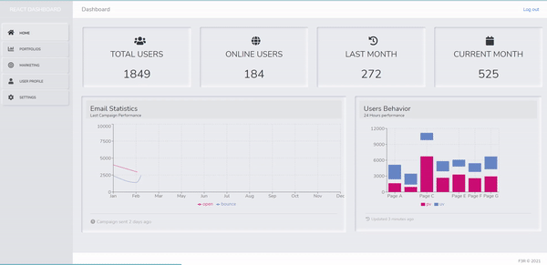

<!-- PROJECT SHIELDS -->
<!--
*** I'm using markdown "reference style" links for readability.
*** Reference links are enclosed in brackets [ ] instead of parentheses ( ).
*** See the bottom of this document for the declaration of the reference variables
*** for contributors-url, forks-url, etc. This is an optional, concise syntax you may use.
*** https://www.markdownguide.org/basic-syntax/#reference-style-links
-->

<!-- PROJECT LOGO -->
<br />
<p align="center">
  <h1 align="center">Simple React Dashboard</h1>
</p>

<!-- ABOUT THE PROJECT -->

## About The Project



Dynamic and Neomorphic Dashboard, an easy to read, one page summary of the analysis of the information.

### Built With

These are the packeges used in this project

`yarn add react-router-dom`

`yarn add recharts`

`yarn add react-countup`

`yarn add material-table`

<!-- GETTING STARTED -->

## Getting Started

This is an example of how you may give instructions on setting up your project locally.
To get a local copy up and running follow these simple example steps.

### Installation

Clone the repo

```sh
git clone https://github.com/ferolo3000/react-dashboard
```

Install NPM packages

```sh
yarn install
```
